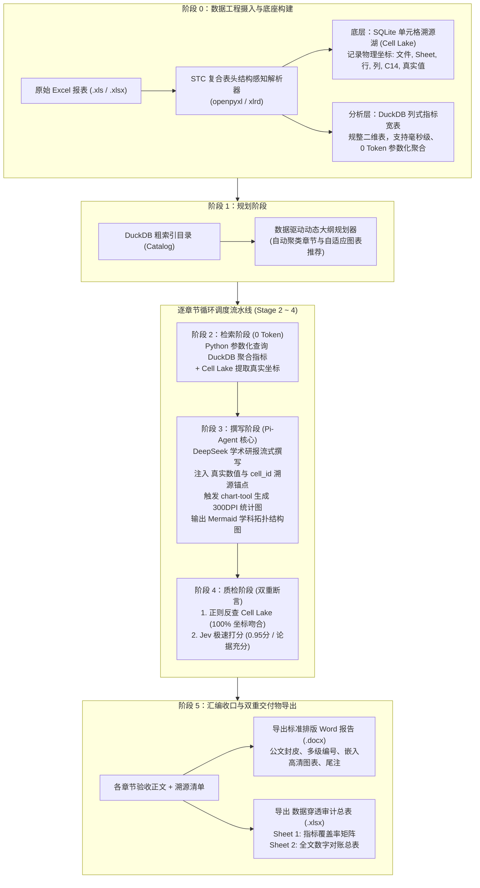

# 高校发展检验报告智能生成系统：全流程技术实现与业务流转说明书 (v2.2)

> **系统定位**：确定性分阶段工作流流水线（Deterministic Staged Pipeline）+ Node.js Pi-Agent 侧车智能体 + Jev 极速判定模型  
> **技术底座**：FastAPI 后端 (8008) + Vue 3 前端 (5173) + SQLite 单元格溯源湖 (Cell Lake) + DuckDB 列式指标宽表  
> **视觉规范**：白色高清晰度教务系统公文规范设计风格 (Multi-Panel Studio)  

---

## 一、 系统全流程架构与数据流转拓扑图



### 通用文本架构图（任何终端与阅读器 100% 兼容显示）

```text
┌─────────────────────────────────────────────────────────────────────────────┐
│                       阶段 0：数据工程摄入与底座构建                          │
│                                                                             │
│  [原始 Excel 报表 (.xls/.xlsx)]                                             │
│               │                                                             │
│               ▼                                                             │
│  [STC 复合表头结构感知解析器] (跨行跨列合并单元格前向填充，展开绝对指标路径)    │
│         ├──────────────────────────────┬──────────────────────────────┤     │
│         ▼                              ▼                              ▼     │
│  [底层: SQLite 单元格溯源湖]    [分析层: DuckDB 列式指标宽表]   [粗索引 Catalog]│
│  归档: (文件, Sheet, 行, 列,    规整二维宽表，提供毫秒级、0     记录各表元数据  │
│  C14坐标, 原始真实文本)         Token 消耗的参数化 SQL 聚合计算 与字段绝对路径  │
└────────────────────────────────────────┬────────────────────────────────────┘
                                         ▼
┌─────────────────────────────────────────────────────────────────────────────┐
│                 阶段 1：规划阶段 (数据驱动动态大纲与自适应图表)                │
│                                                                             │
│  扫描 Catalog 与表头字段 ──> 主题智能聚类 ──> 动态生长章节 ──> 自适应推荐图表 │
│  (支持 8 份高校基准表，更支持任意新上传的未知 Excel 报表动态扩充章节)         │
└────────────────────────────────────────┬────────────────────────────────────┘
                                         ▼
┌─────────────────────────────────────────────────────────────────────────────┐
│                 逐章节闭环流水线调度 (Stage 2 ~ Stage 4)                     │
│                                                                             │
│  [Stage 2: 检索阶段 (0 Token)]                                              │
│  直接下推对应表格，从 Cell Lake 提取 100% 真实坐标 + DuckDB 真实统计指标     │
│               │                                                             │
│               ▼                                                             │
│  [Stage 3: 撰写阶段 (Pi-Agent 核心撰写)]                                    │
│  DeepSeek 学术研报流式撰写 + 注入 [数值][^cell_id] 锚点 + chart-tool 矢量图 │
│               │                                                             │
│               ▼                                                             │
│  [Stage 4: 穿透式质检与 Jev 判定 (双重机器断言)]                            │
│  ① 正则反查 SQLite 单元格真实文本 (100% 吻合) + ② Jev 毫秒级打分 (>= 0.85)  │
└────────────────────────────────────────┬────────────────────────────────────┘
                                         ▼
┌─────────────────────────────────────────────────────────────────────────────┐
│                 阶段 5：汇编收口与双重交付成果物导出                          │
│                                                                             │
│  ┌───────────────────────────────┐     ┌──────────────────────────────────┐ │
│  │ 1. 学术规范研报 (.docx)       │     │ 2. 数据穿透审计与指标清单 (.xlsx)│ │
│  │ 公文封皮、目录、正文多级编号、 │     │ Sheet 1: 指标覆盖率矩阵          │ │
│  │ 嵌入 300DPI 图表、学术标准尾注 │     │ Sheet 2: 全文数字对账总表        │ │
│  └───────────────────────────────┘     └──────────────────────────────────┘ │
└─────────────────────────────────────────────────────────────────────────────┘
```

---

## 二、 阶段详解：从 Excel 上传到最终成果物交付

### 阶段 0：数据工程摄入与底座构建 (Data Ingestion)
- **输入物**：高校教务或评估数据文件（支持多 Sheet 的 `.xls` 与 `.xlsx` 格式）。
- **执行逻辑**：
  1. **STC 复合表头结构感知解析（Span Resolution）**：
     - 同时兼容 `openpyxl`（.xlsx）与 `xlrd`（.xls）；
     - 递归感知跨行、跨列合并单元格（Merged Cell Ranges），执行前向填充（Forward Fill），消除空白缺损；
     - 将多层级表头拼接为唯一绝对指标路径，如：`师资队伍 > 职称结构 > 正高级`、`高层次人才 > 领军人才`。
  2. **单元格入湖（Cell Lake）**：
     - 每个有效数据单元格被赋予唯一哈希主键（`cell_id`）；
     - 将物理文件名称、Sheet 标签名、行号、列号、Excel 坐标代号（如 `C14`）、原始文本全部写入 SQLite `cell_lake` 表中，作为全系统唯一的“真实事实来源”。
  3. **指标注册 DuckDB**：
     - 将展开后的规整二维数据表注册到 DuckDB 内存分析引擎，构建列式指标宽表，提供 0 Token 消耗的毫秒级 SQL 查询能力。
  4. **高校元数据智能感知**：
     - 从 Cell Lake 中自动嗅探学校名称（如“海南师范大学”）、代码与办学性质，并暴露给前端顶栏支持用户随时覆盖重命名。

---

### 阶段 1：两级分层拓扑与大纲规划阶段 (Stage 1: Planning & Jev Verification)
- **核心定位**：数据驱动的两级分层拓扑编排（Two-Level Hierarchical Topology），支持 500+ Excel 规模下的自适应章节分级与物理表预绑定，并在生成前由 Jev 裁判模型进行公文架构合规质检。
- **执行逻辑**：
  1. **宏观领域预绑定 (Table Pre-binding)**：
     - 系统自动将数据湖全量 Catalog 表格预聚类分配至各大教育监测评估标准宏观领域（办学定位、组织师资、专业建设、学科发展、一流专业、教学资源、学生发展、质量保障）；
     - 彻底改变“将所有 Excel 表内容直接喂给大模型”的做法，仅通过元数据目录建立小节与物理表格的强绑定关系（`bound_tables` 与 `bound_files`）。
  2. **自适应细分粒度 (Adaptive Density)**：
     - 根据各领域匹配的数据表数量 $N$ 动态推导小节数量与细分维度：
       - $N \le 3$：浓缩为 1 个精品小节，绑定全部 $N$ 个表；
       - $4 \le N \le 12$：自适应聚类生成 $2 \sim 4$ 个细分小节，切分绑定不同的物理子表；
       - $N > 12$（大规模 500+ 表场景）：聚类生成 $5 \sim 8$ 个小节，切分对应数据子集，避免章节爆炸或上下文溢出。
  3. **Stage 1 Jev 架构质检裁判 (Jev Outline Verification)**：
     - 大纲规划完成后，立即调用 Jev 质检裁判模型执行公文规范性打分（`structure_score`）与未绑定表格排查（`has_unbound_sections`）；
     - 若得分低于 0.85 则触发针对性反馈微调，确保放行的大纲 100% 严谨且全部小节锚定物理表格。
  4. **自适应学术图表推荐**：
     - 根据预绑定表格的列维度与数据类型，自动推导推荐图表策略（机构分布 -> 饼图；横向对比 -> 柱状图；年度演进 -> 折线图）。
  5. **前端大纲与 Jev 徽标实时刷新**：
     - Stage 1 执行完毕后，通过 SSE/WS 推送 `stage_update`（携带 `jev_audit`），前端大纲树与质检评分徽标实时同步展现。

---

### 阶段 2：定向范围参数化检索阶段 (Stage 2: Targeted Scope Retrieval - 0 Token，0 幻觉)
- **核心定位**：基于阶段 1 预绑定的 `bound_files` 与 `bound_tables` 范围进行定向精准抽取，坚决不由大模型手写 SQL 或猜测指标。
- **执行逻辑**：
  1. **定向范围检索 (Targeted Scope Retrieval)**：
     - 检索器只重点穿透该小节预绑定的物理表格（前 8 个核心物理表），杜绝全库检索带来的 Token 暴涨与语义干扰；
  2. **物理坐标提取**：
     - 从 SQLite Cell Lake 中直接抽取对应的物理单元格记录（行号、列号、Excel 代号、表头层级），构建《单元格坐标对照表》；
  3. **数据封装与切片**：
     - 将清洗聚合后的纯净数据包封装为 JSON（数据点摘要、样本单元格列表），直接注入给阶段 3 的 Agent 撰写节点。

---

### 阶段 3：Pi-Agent 学术研报流式撰写阶段 (Stage 3: Writing)
- **核心定位**：专职负责高水平语义生成与学术公文排版，支持双引擎自适应运行。
- **执行逻辑**：
  1. **跨语言 stdio IPC 流式交互**：
     - Python 后端通过异步管道向 Node.js 侧车子进程写入任务 JSON；
     - 侧车子进程驱动模型生成学术公文，并逐行向 stdout 发送 JSONL 事件（`agent_info` -> 连续 `chunk` -> `done`）；
     - 后端将文本块实时中继给前端 SSE 流，呈现实时打字机效果。
  2. **强制穿透锚点注入**：
     - 每一个具体数字必须附带物理溯源标签，格式为 `[数值][^cell_id]`，例如：
       > “我校目前拥有本科专业 [64个][^cell_411_bks]，近三年获批增设新专业 [3个][^cell_411_xzy]。”
  3. **双重图表生成**：
     - **`chart-tool` 高清学术图表**：调用 Python Matplotlib 渲染 300 DPI 学术配色（海军蓝、薄荷翠绿、珊瑚暖橙）的统计图表，保存为 PNG 直插正文与 Word 报告；
     - **`grok-mermaid` 拓扑流程图**：在涉及授权体系或组织架构处，输出规范的 ` ```mermaid ` 代码块。

---

### 阶段 4：穿透式质检与 Jev 判定阶段 (Stage 4: Auditing)
- **核心定位**：双重机器断言机制与自愈重审闭环。
- **执行逻辑**：
  1. **单元格物理反查（100% 机器断言）**：
     - 正则扫描初稿中的所有 `[数值][^cell_id]` 引用；
     - 逐一反查 SQLite Cell Lake，比对报告所引数值与底层原始单元格文本是否完全一致；
     - 吻合率必须达到 **100%**。
  2. **Jev 极速质量决策打分**：
     - 运行 Jev 判别模型（时延 70~300ms），评估逻辑自洽得分（`logic_score >= 0.85`）与证据充分性。
  3. **自愈重审闭环 (Refining Retry)**：
     - 若章节质检未能通过，流水线自动触发 Agent 带反馈修订重写，传入具体的核验不吻合点；
     - 重写后再次执行质检断言，确保交付产物质量过硬。
  4. **百页级报告增量断言存盘 (Checkpointing)**：
     - 每完成并质检通过一个小节，系统自动向 `data/checkpoints/` 写入增量 JSON 快照，保障 100+ 页超长篇幅报告在意外中断时可即时恢复，杜绝重复计算。

---

### 阶段 5：报告汇编与双重成品导出 (Stage 5: Assembly & Export)
- **核心定位**：输出符合高校教务处、评估专家组“查账式”免责要求的双重成果物。
- **交付物**：
  1. **《高校发展检验与质量评估报告》(`.docx`)**：
     - **官方公文封皮**：包含学校名称、编制部门、报告日期与规范边框；
     - **自动目录页 (TOC)**：包含章节小节多级标题与点阵虚线；
     - **正文内嵌图表与 Mermaid 流程图**；
     - **附录数据穿透审计总表**：在文末以正规表格完整列出所有引用的数据点与物理单元格出处。
  2. **《数据穿透审计与指标覆盖清单》(`.xlsx`)**：
     - **Sheet 1: 指标覆盖率矩阵**：罗列全部评估指标、来源表名、覆盖状态与关联章节；
     - **Sheet 2: 全文数字对账总表**：
       `[序号] | [报告章节] | [报告所引数值] | [对应指标绝对路径] | [原始文件名称] | [原始Sheet名] | [单元格坐标(如C14)] | [原始单元格文本] | [穿透核验状态]`

---

## 三、 前端 Multi-Panel Studio 交互界面架构

前端基于 Vue 3 研发，采用纯白背景与深蓝教务基调，打造三栏高密度工作台：

```
+-----------------------------------------------------------------------------------------------------------------------+
|  🏫 高校发展检验报告智能生成系统 [海南师范大学 ✎]  [Cell Lake: 2221格]  [📥载入数据] [⚙️设置] [🚀一键运行全部阶段]    |
+--------------------------+--------------------------------------------------+-----------------------------------------+
|  📂 动态大纲与指标拓扑   |  ⚙️ 确定性流水线调度与 Jev 判定                  |  📄 交互式研报实时预览与穿透气泡        |
|                          |                                                  |                                         |
|  [上传 Excel 拖拽区]     |  【流水线 5 阶段步进指示器】                     |  【高校发展检验与质量评估报告】         |
|  ├─ 1-1基本情况.xlsx     |  Stage 1: 规划阶段 ✅ [Pi-Agent大纲已就绪]        |                                         |
|  ├─ 1-4专业基本.xlsx     |  Stage 2: 检索阶段 ✅ [DuckDB提取完成]            |  学校目前拥有本科专业                   |
|  └─ 4-3一流专业.xlsx     |  Stage 3: 撰写阶段 ✅ [Pi-Agent流式打字输出]      |  [ 64个 ](悬停查看气泡)，其中国家级     |
|                          |  Stage 4: 质检阶段 ✅ [Jev打分:0.95 / 通过]       |  一流专业 [ 15个 ](悬停查看气泡)...     |
|  【报告章节大纲 (实时)】 |  Stage 5: 汇编阶段 ✅ [Word/Excel已导出]          |                                         |
|  ● 第一章 学校概况       |                                                  |  [ 嵌入式 300DPI 学术统计图表 PNG ]     |
|  ● 第二章 组织机构       |  【Jev 质检卡片 (即时打分与断言)】               |                                         |
|  ● 第三章 专业设置       |  ⚡ Jev 逻辑自洽得分: 0.95 / 优秀                |  [ 动态渲染 Mermaid 学科拓扑图 ]        |
|  ● 第四章 学科建设       |  📌 单元格溯源核验: 100% 坐标吻合                |                                         |
|  ● 第五章 一流专业       |                                                  |  -------------------------------------  |
|  ● 第六章 自定义拓展...  |  【执行日志终端 (SSE 实时接收)】                 |  📌 浮动穿透溯源气泡 (Popover):         |
|                          |  >> Stage 1 Pi-Agent 侧车规划完成！              |  文件: 表4-1-1学科建设数据.xls          |
|  【SAT-Graph 拓扑图】    |  >> [sec_1] 章节质检通过！Jev: 0.95             |  工作表: 4-1-1.学科建设                 |
|  实时响应当前入库报表    |  >> 全文总字数: 2273 字, 20处审计点覆盖完毕      |  单元格: D2 (原始值: 64)                |
|                          |                                                  |  状态: ✅ 100% 吻合                     |
+--------------------------+--------------------------------------------------+-----------------------------------------+
```

---

## 四、 核心服务启动与端口说明

| 服务模块 | 默认端口 | 启动脚本 | 说明 |
| :--- | :---: | :--- | :--- |
| **FastAPI 后端** | `8008` | [`run_backend.bat`](file:///d:/vs_project/excel_report/run_backend.bat) | 避开常见软件 8000 端口独占冲突，ANSI/GBK + CRLF 格式 |
| **Vue 3 前端** | `5173` | [`run_frontend.bat`](file:///d:/vs_project/excel_report/run_frontend.bat) | Vite 反向代理自动对齐后端 `8008` 端口 |
| **双端联动启动** | - | [`start_all.bat`](file:///d:/vs_project/excel_report/start_all.bat) | 自动化弹出双窗口分别启动前后端 |
| **成果物输出目录**| - | `backend/data/exports/` | 生成的 Word 报告与 Excel 穿透对账清单保存目录 |
