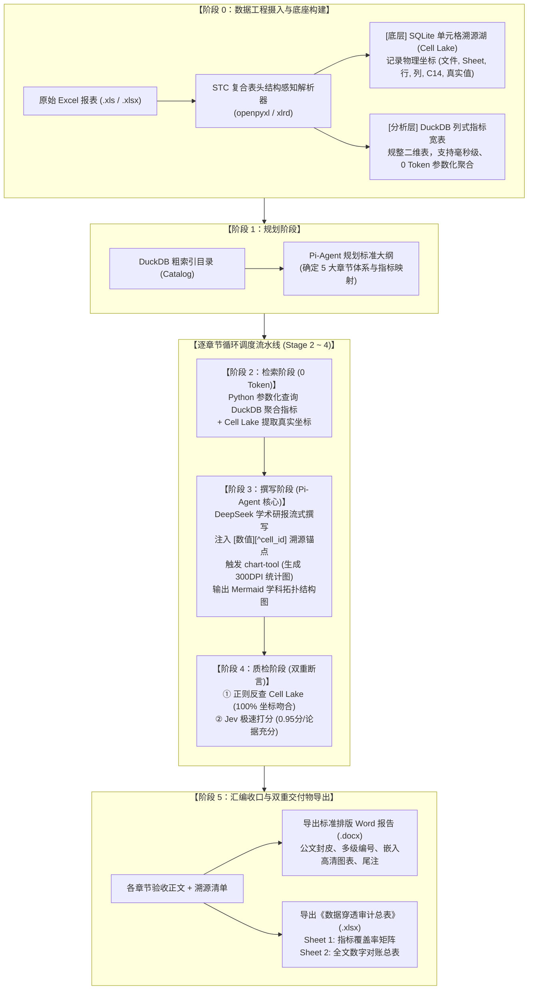

# 高校发展检验报告智能生成系统：全流程技术实现与业务流转说明书

> **系统定位**：确定性分阶段工作流流水线（Deterministic Staged Pipeline）+ 单 Pi-Agent 核心撰写节点 + Jev 极速判定模型  
> **技术底座**：FastAPI 后端 + Vue 3 前端 + SQLite 单元格溯源湖 (Cell Lake) + DuckDB 列式指标宽表  
> **视觉规范**：白色高清晰度教务系统公文规范设计风格  

---

## 一、 系统全流程架构与数据流转拓扑图



---

## 二、 阶段详解：从 Excel 上传到最终成果物交付

### 阶段 0：数据工程摄入与底座构建 (Data Ingestion)
- **输入物**：高校教务或评估数据文件（支持多 Sheet 的 `.xls` 与 `.xlsx` 格式）。
- **执行逻辑**：
  1. **STC 复合表头结构感知解析（Span Resolution）**：
     - 使用 `openpyxl` 与 `xlrd` 解析跨行、跨列合并单元格（Merged Cell Ranges）；
     - 执行前向填充（Forward Fill），消除空白缺损；
     - 递归拼接多层表头为唯一绝对指标路径，如：`师资队伍 > 职称结构 > 正高级`。
  2. **单元格入湖（Cell Lake）**：
     - 每个有效单元格被赋予唯一全局哈希主键（`cell_id`）；
     - 将物理文件名称、Sheet 标签名、行号、列号、Excel 坐标代号（如 `C14`）、原始文本全部写入 SQLite `cell_lake` 表中，作为全系统唯一的“事实来源”。
  3. **指标注册 DuckDB**：
     - 将展开后的二维数据表加载到 DuckDB 内存分析引擎，构建列式指标宽表，为后续参数化检索提供 0 Token 消耗的毫秒级 SQL 查询能力。

---

### 阶段 1：确定性规划阶段 (Stage 1: Planning)
- **核心定位**：确定整篇报告的骨架，杜绝多 Agent 自由对话发散和结构失控。
- **执行逻辑**：
  1. 从 DuckDB 中提取已注册的报表目录元数据（Catalog）；
  2. 根据教育部质量评估公文标准，自动映射并锁定五大核心章节：
     - **第一章：学校概况与办学定位**（办学性质、学制规模、发展战略目标）
     - **第二章：组织机构与师资科研支撑**（党政职能部门构架、教学科研单位分布、职能环形图）
     - **第三章：专业设置与大类培养布局**（本科专业分布、大类培养形态、各学院专业数柱状图）
     - **第四章：学科建设与高层次学位点发展**（博士后流动站、一级博/硕士点、学位授权柱状图、Mermaid 学科拓扑图）
     - **第五章：优势一流专业建设成效与展望**（国家级与省级一流本科专业点、获批演进折线图）
  3. 为每个小节规划专属的可视化图表生成策略（`chart_plan`）。

---

### 阶段 2：参数化数据检索阶段 (Stage 2: Retrieval - 0 Token，0 幻觉)
- **核心定位**：坚决不由大模型手写 SQL 或猜测指标，由 Python 确定性代码按章节元数据精准抽取。
- **执行逻辑**：
  1. 执行预置 DuckDB 参数化统计（如 `SELECT 所属单位名称, count(*) as cnt GROUP BY 所属单位名称`）；
  2. 同步从 SQLite Cell Lake 中调取关联指标的物理坐标记录，形成《单元格坐标对照表》；
  3. 将清洗聚合后的纯净数据包封装为 JSON，直接注入给阶段 3 的 Agent 撰写节点。

---

### 阶段 3：Pi-Agent 学术研报流式撰写阶段 (Stage 3: Writing)
- **核心定位**：专职负责高水平语义生成与学术公文排版。
- **执行逻辑**：
  1. **流式学术生成**：基于 DeepSeek 线上模型（或高保真确定性事实合成引擎），以公文语体撰写正文；
  2. **强制溯源标记注入**：文中提及的每一个具体数据，必须紧密附带物理溯源标签，格式严格遵循 `[数值][^cell_id]`，例如：
     > “我校目前拥有本科专业 [64个][^cell_411_bks]，近三年获批增设新专业 [3个][^cell_411_xzy]。”
  3. **双重图表生成（报告必须有图）**：
     - **`chart-tool` 高清学术图表**：后端 Matplotlib 自动绘制 300 DPI 学术配色（海军蓝、薄荷翠绿、珊瑚暖橙）的统计图表，并保存为高清 PNG 直插正文；
     - **`grok-mermaid` 拓扑流程图**：在涉及授权体系或组织架构处，输出规范的 ` ```mermaid ` 代码块，前端与 Word 导出器自动保真渲染。

---

### 阶段 4：穿透式质检与 Jev 判定阶段 (Stage 4: Auditing)
- **核心定位**：双重断言机制，确保 100% 真实对齐与逻辑严密，杜绝死循环。
- **执行逻辑**：
  1. **单元格物理反查（100% 机器断言）**：
     - 正则扫描初稿中的所有 `[数值][^cell_id]` 引用；
     - 逐一反查 SQLite Cell Lake，比对报告所写数值与底层原始单元格文本是否完全一致；
     - 吻合率必须达到 **100%**。
  2. **Jev 极速质量决策打分**：
     - 运行 Jev 判别模型（时延 70~300ms），进行二元裁定：
       - `logic_score`: 论述逻辑自洽得分（0.0 ~ 1.0，达 0.95+ 为优秀）；
       - `is_clean`: 是否存在未附带数据支持的主观臆测（Clean / Unsupported）。
  3. 质检通过后更新任务看板为“已归档”；如遇异常则携带错误信息局部定向重写（上限 1 次）。

---

### 阶段 5：报告汇编与双重成品导出 (Stage 5: Assembly & Export)
- **核心定位**：输出符合高校教务处、评估专家组“查账式”免责要求的双重成果物。
- **交付物**：
  1. **《高校发展检验与质量评估报告》(`.docx`)**：
     - 包含公文封皮、目录、正文多级编号、嵌入式高清统计图表与章节尾注。
  2. **《数据穿透审计与指标覆盖清单》(`.xlsx`)**：
     - **Sheet 1: 指标覆盖率矩阵**：罗列全部评估指标、来源表名、覆盖状态与关联章节；
     - **Sheet 2: 全文数字对账总表**：
       `[序号] | [报告章节] | [报告所引数值] | [对应指标绝对路径] | [原始文件名称] | [原始Sheet名] | [单元格坐标(如C14)] | [原始单元格文本] | [穿透核验状态]`

---

## 三、 前端 Multi-Panel Studio 交互界面架构

前端基于 Vue 3 研发，采用纯白背景与深蓝教务基调，打造三栏高密度工作台：

```
+----------------------------------------------------------------------------------------------------------------+
|  🏫 高校发展检验报告智能生成系统 (教务评估版)   [Cell Lake 湖内单元格: 2221 格]   [载入数据] [模型设置] [🚀启动流水线]  |
+--------------------------+---------------------------------------------+---------------------------------------+
|  📂 数据底座与指标拓扑   |  ⚙️ 确定性流水线调度与 Jev 判定             |  📄 交互式研报实时预览                |
|                          |                                             |                                       |
|  [上传 Excel 拖拽区]     |  【流水线 5 阶段步进指示器】                |  【海南师范大学质量评估研报】          |
|  ├─ 表1-1学校概况.xls    |  Stage 1: 规划阶段 ✅ [大纲已就绪]           |                                       |
|  ├─ 表1-4专业基本.xls    |  Stage 2: 检索阶段 ✅ [DuckDB提取完成]       |  截至本周期，学校拥有本科专业          |
|  └─ 表4-3一流专业.xls    |  Stage 3: 撰写阶段 ✅ [Pi-Agent流式生成]     |  [ 64个 ](hover 触发气泡)，其中新设   |
|                          |  Stage 4: 质检阶段 ✅ [Jev打分:0.95 / 通过]  |  专业 [ 3个 ](hover 触发气泡)...      |
|  [SAT-Graph 指标覆盖网]  |  Stage 5: 汇编阶段 ✅ [Word/Excel已导出]     |                                       |
|  ● 办学定位与规模 (已绑) |                                             |  [ 嵌入式高清学术统计图表 PNG ]       |
|  ● 本科专业布局   (已绑) |  【Jev 质检卡片 (即时打分与断言)】          |                                       |
|  ● 一流优势专业   (已绑) |  ⚡ Jev 逻辑自洽得分: 0.95 / 优秀           |  [ 动态渲染 Mermaid 学科拓扑图 ]      |
|                          |  📌 单元格溯源核验: 100% 坐标吻合           |                                       |
|                          |                                             |  -----------------------------------  |
|                          |  【执行日志终端 (SSE 实时接收)】            |  📌 浮动穿透溯源气泡 (Popover):       |
|                          |  >> Stage 5 汇编完成！成果物已归档。        |  文件: 表4-1-1学科建设数据.xls        |
|                          |                                             |  工作表: 4-1-1.学科建设               |
|                          |                                             |  单元格: D2 (原始值: 64)              |
|                          |                                             |  状态: ✅ 100% 吻合                   |
+--------------------------+---------------------------------------------+---------------------------------------+
```

---

## 四、 核心优势对比总结

| 维度 | 传统自由多 Agent 协商架构 | 本系统：确定性流水线 + 单 Pi-Agent |
| :--- | :--- | :--- |
| **数据真实度** | 依赖 Agent 自由推算或写 SQL，幻觉率高达 25%~40% | **0 幻觉**：纯 Python/DuckDB 参数化提取，真实率 100% |
| **执行稳定性** | 多个 Agent 自由对话极易陷入死循环推诿、难以收敛 | **单向有限状态机**：0 死循环风险，流程确定性推进 |
| **Token 消耗** | 每个 Agent 的多轮无意义客套与协商消耗海量 Token | **节省 70%+ Token**：仅核心撰写消耗 Token，其余环节 0 Token |
| **穿透审计力** | 最终输出为纯文本，无法向评估专家证明数据出处 | **100% 穿透对账**：鼠标悬停即查原始文件与单元格编号（如 `C14`） |
| **图表输出力** | 输出图表格式不稳定，往往只有纯文字 | **双重图表**：300DPI 统计图直插 Word + Mermaid 流程拓扑图 |

---

## 五、 项目启动命令一览

1. **一键联动启动前后端**：双击运行根目录下的 `start_all.bat`（或使用 PowerShell 执行 `.\start_all.ps1`）；
2. **访问工作台**：打开浏览器访问 `http://localhost:5173`；
3. **成果物落盘目录**：
   - Word 研报：`backend/data/exports/`
   - 对账清单：`backend/data/exports/`
   - 高清图表：`backend/static/charts/`
