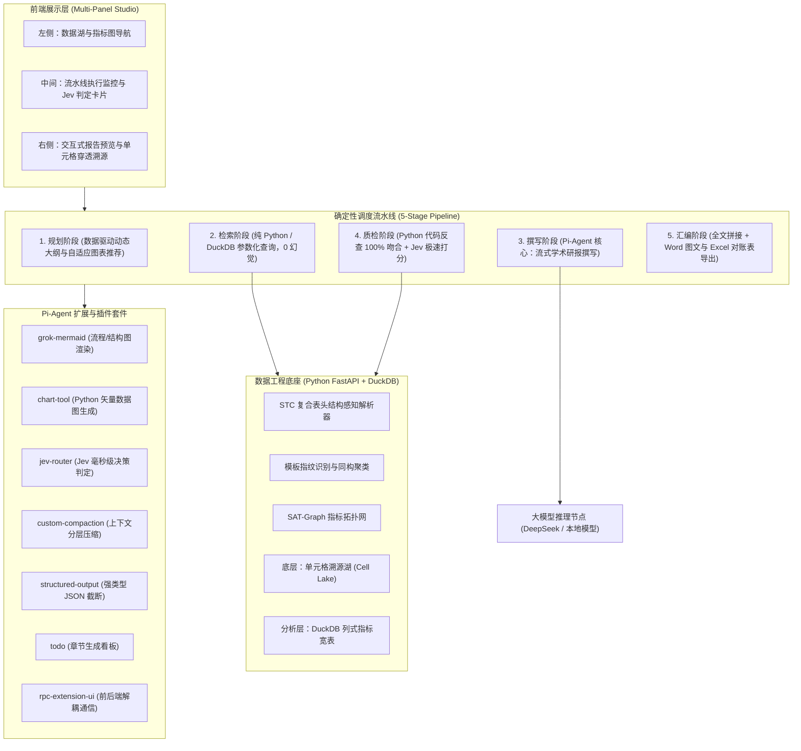
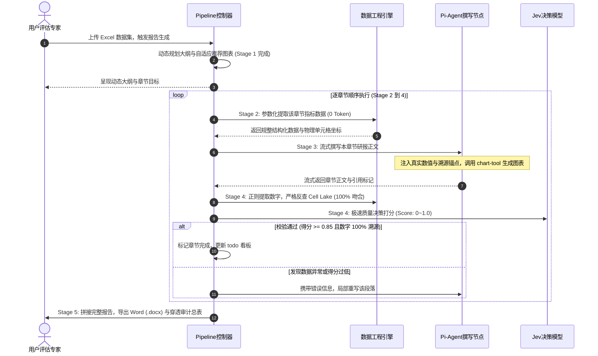

# 高校发展检验报告生成系统：技术架构与工程落地蓝图 (v2.0 工业级流水线版)

> **基座引擎**：Pi-Agent (`@earendil-works/pi-agent-core`) + Python 数据工程微服务  
> **核心定位**：确定性分阶段流水线（Deterministic Staged Pipeline）+ Pi-Agent 撰写节点 + Jev 极速决策模型  
> **交付形态**：前后端分离多面板工作台（Multi-Panel Studio）+ 穿透式数据审计日志  

---

## 一、 架构范式重构：从“多 Agent 协商”到“确定性工作流流水线”

在学术设想中，通常将不同功能拆分成自由对话的多个 Agent（如 CoAgt）。但在严谨的高校公文与评估场景中，**自由多 Agent 协商存在死循环、小模型自由手写 SQL 语法脆弱、长耗时与结果不可控等巨大缺陷**。

本项目坚决践行**工业级软件工程原则**：
- **确定性任务（数据解析、指标检索、数学核对）**：坚决由 Python/DuckDB 代码与规则断言执行，做到 **0 Token 浪费、毫秒级响应、100% 准确**；
- **非结构化语义生成**：交给 **Pi-Agent** 专职负责核心撰写；
- **结构与逻辑合理性质量评估**：交给 **Jev 极速决策模型**（或本地 Judge 判别模型）执行毫秒级打分。

### 系统整体五层流水线架构图



### 通用系统架构图（全终端 100% 文本保真兼容）

```text
┌─────────────────────────────────────────────────────────────────────────────┐
│                      🖥️ 前端展示层 (Multi-Panel Studio)                     │
│  [左侧: 数据湖与指标导航]    [中间: 5阶段流水线与Jev卡片]   [右侧: 报告预览与穿透气泡]│
└──────────────────────────────────────┬──────────────────────────────────────┘
                                       │ WebSocket / HTTP SSE
                                       ▼
┌─────────────────────────────────────────────────────────────────────────────┐
│                   ⚙️ 确定性调度流水线 (Deterministic Pipeline)                │
│  1. 规划阶段 (数据驱动动态大纲) ➔ 2. 检索阶段 (DuckDB 0 Token) ➔             │
│  3. 撰写阶段 (Pi-Agent 核心撰写) ➔ 4. 质检阶段 (反查+Jev打分) ➔ 5. 汇编导出   │
└──────────────┬───────────────────────────────────────────────┬──────────────┘
               │ 调用工具扩展                                   │ 参数化下推
               ▼                                               ▼
┌──────────────────────────────┐              ┌──────────────────────────────┐
│  🔌 Pi-Agent 插件套件        │              │  📊 数据工程底座 (Python)    │
│  • chart-tool (300DPI 统计图)│              │  • STC 复合表头解析器        │
│  • grok-mermaid (拓扑流程图) │              │  • SQLite 单元格溯源湖       │
│  • jev-router (极速打分器)   │              │  • DuckDB 列式指标宽表       │
│  • todo.ts (执行进度看板)    │              │  • 100% 单元格坐标反查服务   │
└──────────────────────────────┘              └──────────────────────────────┘
```


---

## 二、 Pi-Agent 插件与核心能力落地矩阵

充分利用 Pi-Agent 现存的扩展机制（Extensions）、插件（Plugins）与内置模块，免去从零自研的成本：

| 插件/扩展模块 | 源码位置 / 引用参考 | 核心能力与本项目职责 |
| :--- | :--- | :--- |
| **1. `grok-mermaid`**<br/>(内置图表渲染) | [`packages/coding-agent/src/modes/interactive/components/mermaid.ts`](file:///d:/vs_project/excel_report/pi-main/packages/coding-agent/src/modes/interactive/components/mermaid.ts) | **报告内置图表渲染**：Pi-Agent 原生内置对 ` ```mermaid ` 的流式解析支持。自动将 Agent 输出的 Mermaid 语法直接渲染为评估审核流程图、指标拓扑图、学科结构分布图。 |
| **2. `chart-tool`**<br/>(矢量统计图生成工具) | 参考 [`examples/extensions/dynamic-tools.ts`](file:///d:/vs_project/excel_report/pi-main/packages/coding-agent/examples/extensions/dynamic-tools.ts) | **报告统计图表直插**：注册自定义工具 `generate_chart(type, data, title)`，调用 Python 后端 Matplotlib/Seaborn 或 Node 端 Vega-Lite 生成高清矢量 PNG/SVG，直插 Word 报告与前端。 |
| **3. `jev-router`**<br/>(Jev 决策与审计扩展) | [`packages/coding-agent/examples/extensions/jev-router.ts`](file:///d:/vs_project/excel_report/pi-main/packages/coding-agent/examples/extensions/jev-router.ts) | **极速质量评估与数据合理性判定**：复用 Pi-Agent 对 Jev 模型的原生支持（`ctx.modelRegistry.classify()`），对章节初稿进行 `Score` 打分（0~1.0）与异常研判，延迟仅 70~300ms。 |
| **4. `custom-compaction`**<br/>(上下文 Token 压缩插件) | [`packages/coding-agent/examples/extensions/custom-compaction.ts`](file:///d:/vs_project/excel_report/pi-main/packages/coding-agent/examples/extensions/custom-compaction.ts) | **海量表格/长报告上下文压缩**：拦截 `session_before_compact` 事件，在万字长报告与多轮推演中，使用轻量模型对历史对话与表格目录全量提取结构化摘要，压缩率超 80%。 |
| **5. `structured-output`**<br/>(强类型输出约束工具) | [`packages/coding-agent/examples/extensions/structured-output.ts`](file:///d:/vs_project/excel_report/pi-main/packages/coding-agent/examples/extensions/structured-output.ts) | **大纲与目录确定性截断**：基于 TypeBox Schema 强制约束输出结构；配置 `terminate: true`，确保生成完目录大纲 JSON 后一次性结转，杜绝小模型吐出多余闲聊废话。 |
| **6. `todo.ts`**<br/>(任务进度追踪扩展) | [`packages/coding-agent/examples/extensions/todo.ts`](file:///d:/vs_project/excel_report/pi-main/packages/coding-agent/examples/extensions/todo.ts) | **全书章节进度状态看板**：实时维护多章节任务状态队列（`待检索` -> `撰写中` -> `Jev审计中` -> `已归档`），并实时推送至前端界面。 |
| **7. `rpc-extension-ui` / Chord**<br/>(前后端解耦中枢) | [`packages/coding-agent/examples/rpc-extension-ui.ts`](file:///d:/vs_project/excel_report/pi-main/packages/coding-agent/examples/rpc-extension-ui.ts) & [`packages/chord/`](file:///d:/vs_project/excel_report/pi-main/packages/chord) | **无头服务与 WebUI 通信中枢**：将 Pi-Agent 作为后台无头守护服务运行，通过 RPC / WebSocket 协议将生成流、图表与审计卡片实时传递给前端 Web 工作台。 |
| **8. Agent Skills 规范**<br/>(`.agents/skills/`) | [`packages/coding-agent/docs/skills.md`](file:///d:/vs_project/excel_report/pi-main/packages/coding-agent/docs/skills.md) | **领域评估规范按需加载**：为不同学科、学院类别编写独立的 `SKILL.md`（如教育部评估红线、生师比达标算法），Agent 按需加载，不挤占全局 Prompt。 |

---

## 三、 第一层：Ingestion 结构化解析与双重压缩层

针对高校/院系复杂业务报表（多级复合表头、单元格跨行跨列合并、年度与学院模板异构），设计如下解析与压缩机制：

### 1. 复合表头扁平化（Span Resolution）与模板指纹生成
- **网格补全与绝对路径合并**：
  采用 Python `openpyxl` / `calamine` 解析单元格合并区域（MergedCellRanges），执行前向填充（Forward Fill）。
  - Row 1: `师资队伍` (Col 2~5)
  - Row 2: `职称结构` (Col 2~3), `学位结构` (Col 4~5)
  - Row 3: `正高级`, `副高级`, `博士`, `硕士`
  - 展开后生成唯一指标绝对路径：`师资队伍 > 职称结构 > 正高级`。
- **模板指纹算法（Template Fingerprint）**：
  提取工作表签名（`Sheet 列表` + `规范化表头绝对路径列表` + `列数据类型`），通过哈希对齐：
  - 命中已知模板：自动存入对应统一指标宽表；
  - 新模板：提示用户确认指标对应关系。

### 2. 双层存储设计（保证 100% 溯源与高并发毫秒查询）

```
原始 Excel 文件 
     │ (STC 结构感知解析)
     ├───► [底层] 单元格溯源湖 (Cell Lake / SQLite)
     │     存储每格坐标: (file, sheet, row, col, year, dept, metric_path, raw_value, unit, cell_ref)
     │     👉 专用于正文数字的 100% 精确穿透查验与反向定位
     │
     └───► [分析层] DuckDB 列式指标宽表 (Parquet 物理压缩)
           规整多年度、多学院二维表，支持列式压缩 (Parquet 压缩率超 80%)
           👉 专用于提供毫秒级、0 Token 消耗的 Python 参数化查询聚合 (SUM/AVG/CAGR)
```

### 3. 指标语义图（SAT-Graph）与双级索引
- **粗索引目录（Catalog Layer，极低 Token 消耗）**：
  仅记录：`{模板ID, 包含指标集合, 覆盖年份, 覆盖学院, 数据体量}`。全表目录约 1k~2k tokens，规划阶段一次性加载，不占用长上下文。
- **细索引（SAT-Graph 拓扑图）**：
  使用 NetworkX 构建：节点=指标，边=计算公式依赖（如 `生师比 = 在校折合生 / 专任教师`）。数据提取函数根据图依赖，自动一并查出分子和分母基础数据。

---

## 四、 第二层：五阶段流水线执行机制（流水线替代多 Agent）



### 通用业务时序图（全终端 100% 兼容文本格式）

```text
 用户 / 评估专家         Pipeline 控制器          数据工程引擎 (DuckDB/Lake)    Pi-Agent 核心撰写节点        Jev 质检判定模型
      │                         │                            │                           │                       │
      │ 1. 上传 Excel 报表       │                            │                           │                       │
      ├────────────────────────>│                            │                           │                       │
      │                         │ 2. 数据驱动动态大纲规划      │                           │                       │
      │< - - - - - - - - - - - -┤ (Stage 1 完成)             │                           │                       │
      │   呈现动态章节与图表计划 │                            │                           │                       │
      │                         │                            │                           │                       │
      │                         │==== [逐章节循环执行 Stage 2 ~ Stage 4] ===============================================│
      │                         │ 3. 参数化提取指标与坐标     │                           │                       │
      │                         ├───────────────────────────>│                           │                       │
      │                         │<───────────────────────────┤                           │                       │
      │                         │    返回结构化真实数据      │                           │                       │
      │                         │                            │                           │                       │
      │                         │ 4. 流式撰写正文与图表直插  │                           │                       │
      │                         ├───────────────────────────────────────────────────────>│                       │
      │                         │< - - - - - - - - - - - - - - - - - - - - - - - - - - - ┤                       │
      │                         │    流式推送 [数值][^cell_id] 锚点与 300DPI 统计图      │                       │
      │                         │                                                        │                       │
      │                         │ 5. 100% 单元格反查与 Jev 质量判定                      │                       │
      │                         ├───────────────────────────>│                           │                       │
      │                         │<───────────────────────────┤                           │                       │
      │                         │    机器断言: 100% 坐标吻合 │                           │                       │
      │                         ├───────────────────────────────────────────────────────────────────────────────>│
      │                         │<───────────────────────────────────────────────────────────────────────────────┤
      │                         │    Jev 逻辑打分 (0.95/通过)│                           │                       │
      │                         │========================================================================================│
      │                         │                                                        │                       │
      │ 6. 导出最终双成果物     │                                                        │                       │
      │<────────────────────────┤                                                        │                       │
      │  Word 研报 + 穿透总表   │                                                        │                       │
```


### 为什么这一流水线设计绝对优于自由多 Agent？
1. **0 幻觉数据下钻**：检索阶段不是让 LLM 自由猜 SQL，而是 Python 代码根据章节元数据直接执行预置 DuckDB 函数，数据提取成功率从 LLM 的 75% 跃升至 **100%**；
2. **0 死循环风险**：流水线状态机单向流转，异常有明确的回滚上限（最多重试 1 次），绝对不会发生多个 Agent 互相推诿或无休止争论；
3. **极低成本与超快速度**：整篇报告只有“正文生成”消耗主模型 Token，其他环节全为本地代码与 Jev 毫秒级计算，全篇生成时间缩短 70% 以上。

---

## 五、 第三层：Jev 决策模型与审计质检机制

### 1. Jev 模型特性与资源配置
Jev 是 TypeSafe AI 的 System One 决策模型，通过直接计算 Logits 进行离散选择（Choice）、连续打分（Score）与布尔判断（Noul），**不产生文本生成延迟**。

- **硬件资源**：
  - **Jev 官方私有化容器**：单卡 **4GB ~ 8GB VRAM**（如 RTX 3060/4060），或 4~8 线程纯 CPU 推断；
  - **离线开源平替**：使用 `Qwen2.5-3B-Instruct` 配合 vLLM/SGLang 的 Guided Decoding（约束 Logits 输出），单卡 6GB 显存即可满血运行。
- **响应时延**：每次调用约 **70ms ~ 300ms**，对比生成式大模型的 3~10 秒，几乎无感。

### 2. Pi-Agent 中调用 Jev 的实现方式（复用 `jev-router.ts` 设计）
```typescript
import type { ExtensionContext } from "@earendil-works/pi-coding-agent";

export async function evaluateSectionQuality(
  ctx: ExtensionContext, 
  sectionTitle: string, 
  draftContent: string
) {
  // 从 Pi-Agent 模型注册表中获取 Jev 分类器
  const jev = ctx.modelRegistry.findOfType("classifier", "typesafe", "jev-latest");
  if (!jev) return { score: 1.0, approved: true };

  const result = await ctx.modelRegistry.classify(jev, {
    state: { title: sectionTitle, draft: draftContent.slice(0, 8000) },
    questions: {
      logicConsistency: {
        type: "score",
        instructions: "评估该章节对指标数据的分析推理是否逻辑严密、无常识性矛盾 (0.0 - 1.0)"
      },
      hasUnsupportedClaims: {
        type: "choice",
        instructions: "该章节是否存在未附带数据支持的主观臆断？",
        criteria: {
          clean: "结论均有据可循",
          unsupported: "存在无数据支撑的武断陈述"
        }
      }
    }
  });

  return result.answers;
}
```

---

## 六、 第四层：前端 Multi-Panel Studio 交互架构

前端构建极致丝滑、符合高阶学术与工程质感的工作台（深浅色沉浸主题、微动画流、多面板协同）：

```
+-------------------------------------------------------------------------------------------------------+
|  📊 高校发展检验报告智能生成系统 (Pi-Agent Studio)                     [当前模板: 2023-2025教学评估集 v2]   |
+---------------------+-------------------------------------------------+-------------------------------+
|  📂 模板与指标树    |  ⚡ 智能流水线执行流 (实时进度与 Jev 判定)      |  📄 报告实时交互预览          |
|                     |                                                 |                               |
| [已解析模板: 3]     |  [Stage 1: 规划] ✅ 标准规范大纲已就绪          |  # 第一章 师资队伍与资源建设  |
| ├─ 01_师资力量表     |                                                 |                               |
| ├─ 02_教学经费表     |  [Stage 2: 检索] ✅ DuckDB 提取 24 条指标完成   |  2024年度，我院专任教师总数   |
| └─ 03_科研成果表     |                                                 |  达到 [ 128人 ](hover:溯源)， |
|                     |  [Stage 3: 撰写] 🌟 Pi-Agent 正在流式生成正文...|  其中副高及以上职称占比达      |
| [SAT-Graph 指标网]  |  > 生成字数: 1,420 字 | 注入图表: 师资结构图.png |  [ 64.8% ](hover:溯源)，...   |
| ● 专任教师 (已绑定) |                                                 |                               |
| ● 生师比   (已绑定) |  [Stage 4: 质检卡片 (Python 反查 + Jev 判定)]   |  ---------------------------  |
| ⚠️ 考研率 (未绑定)  |  ✅ 单元格溯源核验: 8/8 处数字 100% 吻合        |  📌 浮动溯源气泡:             |
|                     |  ⚡ Jev 逻辑自洽得分: [ 0.94 / 优秀 ]           |  文件: 2024_师资明细.xlsx     |
| [操作栏]            |  ⚡ Jev 论据充分判定: [ Clean / 无主观臆断 ]    |  工作表: 队伍结构汇总         |
| [重新解析] [批量导出]|  👉 [当前小节已自动验收归档]                    |  单元格: C14 (值: 128)        |
+---------------------+-------------------------------------------------+-------------------------------+
```

---

## 七、 第五层：成品交付物规范

系统一键生成的成果物包含以下两部分：

1. **带学术排版的正式报告（`.docx` / `.pdf`）**：
   - 自动生成目录与层级标题编号；
   - 动态内嵌由 `chart-tool` 基于 DuckDB 生成的高清统计图表与 `grok-mermaid` 流程结构图；
   - 每个引用的数字自动排版为末尾标准尾注（Endnotes），标明数据来源。
2. **《数据穿透审计与指标覆盖清单》（`.xlsx` / `.html`）**：
   - **Sheet 1: 指标覆盖率矩阵**：罗列 100+ 项评估指标、是否已被纳入报告分析、对应章节与段落行号。
   - **Sheet 2: 全文数字对账总表**：
     `[报告段落] | [报告所引数值] | [原始文件路径] | [Sheet 名] | [单元格坐标(如 C14)] | [原始单元格文本] | [Jev 核验状态]`
   - 彻底满足高校教务处、评估专家组的**“查账式”免责与穿透审计**需求。

---

## 八、 实施推进步骤 (Milestone Plan)


### 实施路线一览表（通用文本视图）

| 实施阶段 | 核心攻坚模块 | 关键交付物 | 达成目标 |
| :--- | :--- | :--- | :--- |
| **阶段一：数据与解析底座** | STC复合表头解析、Cell Lake、DuckDB指标库 | `stc_parser.py`, `cell_lake.db`, `metrics.duckdb` | 消除合并单元格缺损，构建真实物理坐标湖 |
| **阶段二：Pi-Agent 扩展与撰写** | chart-tool 图表生成、动态大纲规划器、流式Prompt | `agent_runner.py`, `chart_service.py` | 300DPI 图表直插、注入真实数值与溯源锚点 |
| **阶段三：质检断言与双导出** | 100% 正则反查、Jev 毫秒打分、Word/Excel 导出器 | `audit_service.py`, `jev_judge.py`, `docx_exporter.py` | 机器双重断言、生成带公文规范的报告与对账表 |
| **阶段四：前端 Studio 与联调** | Vue 3 三栏教务风面板、悬浮反查气泡、全链路压测 | `App.vue`, `style.css`, `test_e2e_pipeline.py` | 实时流式监控、毫秒级穿透查验、端到端一键闭环 |

