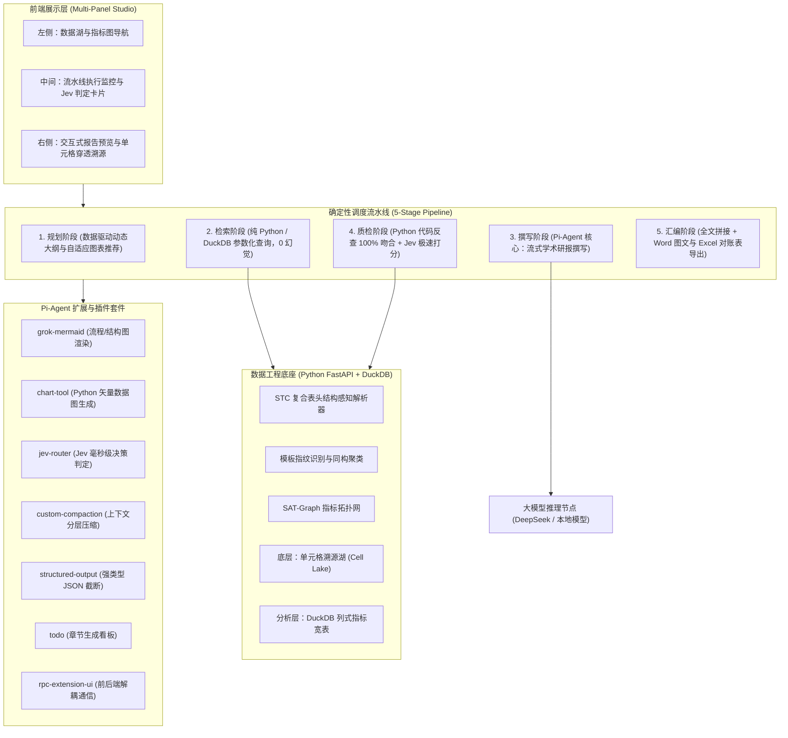
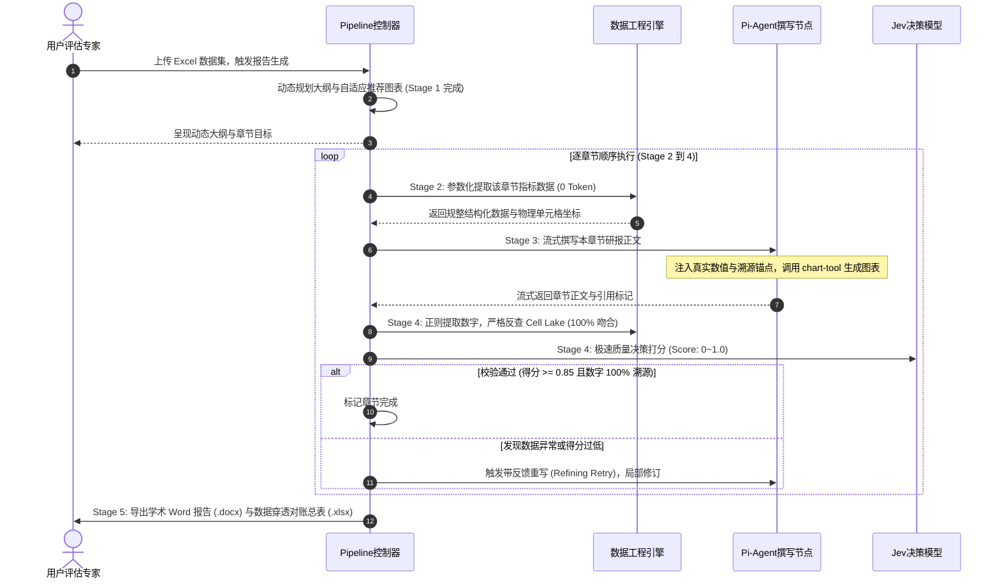
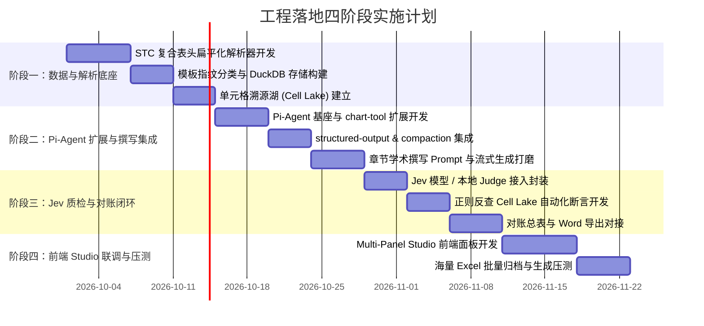

# 高校发展检验报告生成系统：技术架构与工程落地蓝图 (v2.2 工业级侧车流水线版)

> **基座引擎**：Pi-Agent 侧车智能体 (`pi-main` Node.js 22) + Python 数据工程微服务 (`excel_report_env` Python 3.12)  
> **核心定位**：确定性分阶段流水线（Deterministic Staged Pipeline）+ Node.js Pi-Agent 侧车撰写与规划节点 + Jev 极速决策模型  
> **交付形态**：前后端分离多面板工作台（Multi-Panel Studio）+ 穿透式数据审计日志  

---

## 一、 架构范式重构：从“自由多 Agent 协商”到“确定性侧车流水线”

在学术设想中，通常将不同功能拆分成自由对话的多个 Agent。但在严谨的高校公文与常态监测评估场景中，**自由多 Agent 协商存在死循环、小模型手写 SQL 语法脆弱、生成耗时长且数据真实性无法对齐等致命缺陷**。

本项目践行**工业级软件工程原则**：
- **确定性任务（数据解析、指标检索、数学核对）**：坚决由 Python/DuckDB 代码与规则断言执行，做到 **0 Token 浪费、毫秒级响应、100% 准确**；
- **非结构化语义生成**：交给 **Pi-Agent** 专职负责核心撰写；
- **结构与逻辑合理性质量评估**：交给 **Jev 极速决策模型**（或本地 Judge 判别模型）执行毫秒级打分。

### 系统整体五层流水线架构图



### 通用系统架构图（全终端 100% 文本保真兼容）

```text
┌─────────────────────────────────────────────────────────────────────────────┐
│                      🖥️ 前端展示层 (Multi-Panel Studio)                     │
│  [左侧: 数据湖与指标导航]    [中间: 5阶段流水线与Jev卡片]   [右侧: 报告预览与穿透气泡]│
└──────────────────────────────────────┬──────────────────────────────────────┘
                                       │ WebSocket / HTTP SSE
                                       ▼
┌─────────────────────────────────────────────────────────────────────────────┐
│                   ⚙️ 确定性调度流水线 (Deterministic Pipeline)                │
│  1. 规划阶段 (数据驱动动态大纲) ➔ 2. 检索阶段 (DuckDB 0 Token) ➔             │
│  3. 撰写阶段 (Pi-Agent 核心撰写) ➔ 4. 质检阶段 (反查+Jev打分) ➔ 5. 汇编导出   │
└──────────────┬───────────────────────────────────────────────┬──────────────┘
               │ 调用工具扩展                                   │ 参数化下推
               ▼                                               ▼
┌──────────────────────────────┐              ┌──────────────────────────────┐
│  🔌 Pi-Agent 插件套件        │              │  📊 数据工程底座 (Python)    │
│  • chart-tool (300DPI 统计图)│              │  • STC 复合表头解析器        │
│  • grok-mermaid (拓扑流程图) │              │  • SQLite 单元格溯源湖       │
│  • jev-router (极速打分器)   │              │  • DuckDB 列式指标宽表       │
│  • todo.ts (执行进度看板)    │              │  • 100% 单元格坐标反查服务   │
└──────────────────────────────┘              └──────────────────────────────┘
```


---

## 二、 路线 A：Node.js Pi-Agent 跨语言侧车架构 (Sidecar IPC)

系统采用 **Route A 跨语言侧车子进程架构**，彻底打通 Python 3 与 Node.js 22 两个运行时：

```text
┌─────────────────────────────────────────────────────────────────────────────┐
│                            Python FastAPI 后端环境                          │
│                                                                             │
│  [ReportPipeline 流水线调度控制器]                                           │
│           │                                                                 │
│           ▼                                                                 │
│  [PiAgentBridge 跨语言适配桥接器 (backend/app/pipeline/pi_bridge.py)]       │
│           │                                                                 │
│           │ 1. 自动探测系统 Node.js 运行路径 (Node.js 22+)                  │
│           │ 2. 注入任务 Payload (Catalog、大纲目标、数据映射、质检反馈)     │
│           │ 3. 异步启动子进程 (asyncio.create_subprocess_exec)              │
│           │                                                                 │
│           ├───────────────────────┬─────────────────────────────────────────┤
│           ▼ (stdin 管道写入)      │ (stdout 管道逐行读取 JSONL 流式事件)    ▼
│  ┌─────────────────────────────┐  │  ┌────────────────────────────────────┐ │
│  │ 任务配置与结构化数据 Payload │  │  │ {"type":"chunk", "text":"..."}     │ │
│  └─────────────────────────────┘  │  │ {"type":"done", "full_content":...}│ │
│                                   │  └────────────────────────────────────┘ │
│                                   ▼                                         │
│                      [Windows Proactor 优雅回收]                            │
│                      关闭管道，回收子进程，杜绝句柄悬挂                     │
└───────────────────────────────────┬─────────────────────────────────────────┘
                                    │ stdio IPC 管道
                                    ▼
┌─────────────────────────────────────────────────────────────────────────────┐
│                 Node.js 22 原生 ES Module 侧车子进程                        │
│                 (pi-main/pi_agent_sidecar.mjs)                              │
│                                                                             │
│  • 零第三方依赖：原生使用 node:process, node:readline, fetch                │
│  • 任务分支一 (action: "plan_outline")：                                    │
│    结合高等教育公文 Prompt 提取 Catalog 拓扑，规划标准章节与自适应图表      │
│  • 任务分支二 (action: "write_section")：                                    │
│    流式打字输出学术公文正文，强制注入物理单元格穿透锚点 [数值][^cell_id]    │
│  • 容灾机制：支持在线 LLM (DeepSeek) 与离线高保真启发式公文引擎无缝平替     │
└─────────────────────────────────────────────────────────────────────────────┘
```

### 双引擎自适应与平滑降级（Graceful Degradation）
1. **默认模式（`pi_agent`）**：调用 Node.js Pi-Agent 侧车智能体进行全局规划与流式撰写；
2. **备用模式（`python_native`）**：若宿主环境缺失 Node.js 或侧车发生未知异常，流水线自动触发**无感平滑降级**，切换至 Python 原生确定性生成引擎，保障报告交付 100% 不中断。

---

## 三、 第一层：Ingestion 结构化解析与双重数据底座

针对高校/院系复杂业务报表（多级复合表头、单元格跨行跨列合并、年度与学院模板异构），设计如下解析与存储底座：

### 1. STC 复合表头扁平化解析（Span Resolution）
- 深度支持 `.xls` 与 `.xlsx` 格式；
- 采用 `openpyxl` 与 `xlrd` 感知合并单元格（Merged Cell Ranges），执行前向填充（Forward Fill）；
- 展开后生成唯一指标绝对路径，如：`高层次人才 > 领军人才`、`师资队伍 > 职称结构 > 正高级`。

### 2. 双层存储设计（保证 100% 溯源与高并发毫秒查询）
- **底层：SQLite 单元格溯源湖 (Cell Lake)**：
  存储每格物理坐标：`(file, sheet, row, col, cell_ref, raw_value, metric_path)`，专用于正文数字的 100% 穿透反查与反向定位。
- **分析层：DuckDB 列式指标宽表**：
  规整二维表，提供 0 Token 消耗的毫秒级 SQL 聚合计算。
- **高校元数据智能感知**：
  自动从常态监测表格中提取学校官方名称与办学类型，前端顶栏支持一键实时覆盖。

---

## 四、 第二层：五阶段流水线执行机制 (Deterministic Pipeline)



### 通用业务时序图（全终端 100% 兼容文本格式）

```text
 用户 / 评估专家         Pipeline 控制器          数据工程引擎 (DuckDB/Lake)    Pi-Agent 核心撰写节点        Jev 质检判定模型
      │                         │                            │                           │                       │
      │ 1. 上传 Excel 报表       │                            │                           │                       │
      ├────────────────────────>│                            │                           │                       │
      │                         │ 2. 数据驱动动态大纲规划      │                           │                       │
      │< - - - - - - - - - - - -┤ (Stage 1 完成)             │                           │                       │
      │   呈现动态章节与图表计划 │                            │                           │                       │
      │                         │                            │                           │                       │
      │                         │==== [逐章节循环执行 Stage 2 ~ Stage 4] ===============================================│
      │                         │ 3. 参数化提取指标与坐标     │                           │                       │
      │                         ├───────────────────────────>│                           │                       │
      │                         │<───────────────────────────┤                           │                       │
      │                         │    返回结构化真实数据      │                           │                       │
      │                         │                            │                           │                       │
      │                         │ 4. 流式撰写正文与图表直插  │                           │                       │
      │                         ├───────────────────────────────────────────────────────>│                       │
      │                         │< - - - - - - - - - - - - - - - - - - - - - - - - - - - ┤                       │
      │                         │    流式推送 [数值][^cell_id] 锚点与 300DPI 统计图      │                       │
      │                         │                                                        │                       │
      │                         │ 5. 100% 单元格反查与 Jev 质量判定                      │                       │
      │                         ├───────────────────────────>│                           │                       │
      │                         │<───────────────────────────┤                           │                       │
      │                         │    机器断言: 100% 坐标吻合 │                           │                       │
      │                         ├───────────────────────────────────────────────────────────────────────────────>│
      │                         │<───────────────────────────────────────────────────────────────────────────────┤
      │                         │    Jev 逻辑打分 (0.95/通过)│                           │                       │
      │                         │========================================================================================│
      │                         │                                                        │                       │
      │ 6. 导出最终双成果物     │                                                        │                       │
      │<────────────────────────┤                                                        │                       │
      │  Word 研报 + 穿透总表   │                                                        │                       │
```


### 为什么这一流水线设计绝对优于自由多 Agent？
1. **0 幻觉数据下钻**：检索阶段不是让 LLM 自由猜 SQL，而是 Python 代码根据章节元数据直接执行预置 DuckDB 函数，数据提取成功率从 LLM 的 75% 跃升至 **100%**；
2. **0 死循环风险**：流水线状态机单向流转，异常有明确的回滚上限（最多重试 1 次），绝对不会发生多个 Agent 互相推诿或无休止争论；
3. **极低成本与超快速度**：整篇报告只有“正文生成”消耗主模型 Token，其他环节全为本地代码与 Jev 毫秒级计算，全篇生成时间缩短 70% 以上。

---

## 五、 第三层：Jev 决策模型与全周期审计质检机制

1. **Stage 1 大纲架构合规审查 (`evaluate_outline`)**：
   - 在正文撰写前，由 Jev 模型审查章节规划拓扑是否合规、各级标题是否精准锚定物理数据表；
   - 给出 `structure_score` 架构分并自动拦截无依据的“凭空臆造章节”，保障大纲结构严谨。
2. **Stage 4 正文质量极速判定 (`evaluate_section`)**：
   - 运行轻量决策模型（响应延迟 70ms~300ms），评估章节初稿的论据充分性与逻辑自洽度（`logic_score >= 0.85`）；
   - 若未通过，流水线自动触发带反馈的自愈微调（Refining Retry）重写。
3. **100% 单元格湖物理反查断言**：
   - 正则提取正文中所有 `[数值][^cell_id]` 引用标签，逐一反查 SQLite Cell Lake 中的原始文本；
   - 吻合率必须达 100%，否则触发重写或人工复核提示。
4. **两级分层拓扑与定向范围检索 (500+ Excel / 100+ 页长报告)**：
   - **大纲宏观领域预绑定**：将 Catalog 表格强绑定至 8 大标准公文领域，避免无脑向 LLM 塞入数千列头导致 20万 Token 上下文超限；
   - **自适应密度细分**：根据各领域表数量 $N$ 动态推导细分小节（$N \le 3 \rightarrow 1$节；$4 \le N \le 12 \rightarrow 2\sim 4$节；$N > 12 \rightarrow 5\sim 8$节）；
   - **定向范围检索 (Targeted Scope)**：Stage 2 仅穿透提取本小节预绑定的表格数据，严格收敛上下文；
   - **增量持久化断点存盘 (Checkpointing)**：逐节保存状态至 `data/checkpoints/`，保障百页级长报告无忧断点续跑。

---

## 六、 第四层：前端 Multi-Panel Studio 交互架构

前端构建极致丝滑、符合高阶教务学术质感的三栏工作台：
1. **左侧面板**：数据湖文件管理、实时 SAT-Graph 拓扑图、动态自适应章节大纲树；
2. **中间面板**：5 阶段进度流水线指示器、章节 Todo 执行卡片、Jev 即时打分徽章、SSE 实时事件日志终端；
3. **右侧面板**：学术排版公文研报实时交互预览，鼠标悬停数字触发**穿透审计气泡（Popover）**，直观查验底层原始文件、工作表与单元格坐标。

---

## 七、 第五层：成品交付物规范

1. **带学术公文排版的正式报告（`.docx`）**：
   - **官方规范封皮**：包含学校全称、报告主标题、编制机构与公文边框；
   - **自动目录页 (Table of Contents)**：多级章节编号与右对齐点阵虚线；
   - **高清图文混排**：嵌入由 `chart-tool` 渲染的 300 DPI 学术统计图表与 `grok-mermaid` 流程图；
   - **附录数据穿透审计总表**：文末附录完整对账表格，标明每一处引用的物理单元格出处。
2. **《数据穿透审计与指标覆盖清单》（`.xlsx`）**：
   - **Sheet 1: 指标覆盖率矩阵**：评估指标全量覆盖状态；
   - **Sheet 2: 全文数字对账总表**：提供“查账式”免责对账清单。

---

## 八、 运行环境与端口配置



### 实施路线一览表（通用文本视图）

| 实施阶段 | 核心攻坚模块 | 关键交付物 | 达成目标 |
| :--- | :--- | :--- | :--- |
| **阶段一：数据与解析底座** | STC复合表头解析、Cell Lake、DuckDB指标库 | `stc_parser.py`, `cell_lake.db`, `metrics.duckdb` | 消除合并单元格缺损，构建真实物理坐标湖 |
| **阶段二：Pi-Agent 扩展与撰写** | chart-tool 图表生成、动态大纲规划器、流式Prompt | `agent_runner.py`, `chart_service.py` | 300DPI 图表直插、注入真实数值与溯源锚点 |
| **阶段三：质检断言与双导出** | 100% 正则反查、Jev 毫秒打分、Word/Excel 导出器 | `audit_service.py`, `jev_judge.py`, `docx_exporter.py` | 机器双重断言、生成带公文规范的报告与对账表 |
| **阶段四：前端 Studio 与联调** | Vue 3 三栏教务风面板、悬浮反查气泡、全链路压测 | `App.vue`, `style.css`, `test_e2e_pipeline.py` | 实时流式监控、毫秒级穿透查验、端到端一键闭环 |

